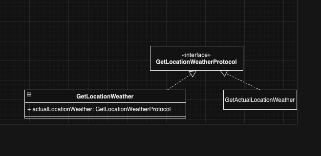

#  iOS Weather App architecture

This app is created using Onion Architecture / Clean Architecture to provide testability and modularity. It enables us to having an isolated component and trivial test.
We have our domain layer that responsible to model our app that its business case is asking for a weather information based on its current location or user input location.
Thus the infrastructure layer will only act as an I/O to the GUI(using UIKit), Network request(using URLSession) and LocationServices(using CoreLocation).
Each component is being develop by using Test-First development. It enables us to have a test as our documentation about how every module works.
We use Factory pattern to inject dependency by filling in the functions that is needed for each module to work correctly. Later on we could use DI library as [Swinject](https://github.com/Swinject/Swinject) to automate the process.

We also have an example on how a GetLocationWeather class is a Decorator that hide GetActualLocationWeather that enables the app to ask for user location from Location Services.
It makes the ViewModel has no information about the internal behavior of the use case.

When you check the test cases. We have several target tests.
- weatherappIntegrationTests
- weatherappTests
- weatherappUITests

### weatherappIntegrationTests
this test target consists of several test cases for each api class that requesting our API server. It can be execute daily to check if our API server still respond with the same expected responses.

### weatherappTests
it consists of Unit tests for our domain and can be executed every time we are doing development. It has to be fast and we could have fast feedback and check if business case is still in good shape.

### weatherappUITests
It is created as our Acceptance test to check every feature is working correctly and integrated in the app. 
